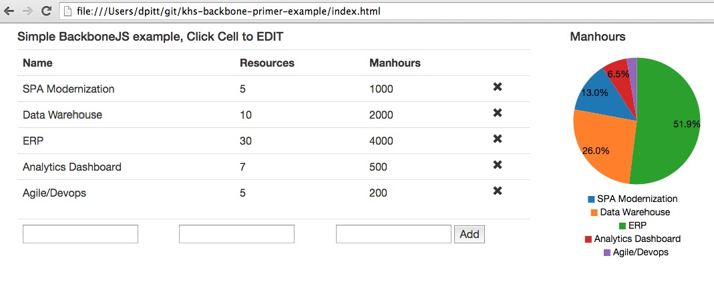

# khs-backbone-primer-example
A simple Backbone.js CRUD implementation with dynamic D3 Graph.

Shows the power of a client SPA built with Backbone.js Views and Models.

No server required, just open the `index.html` from a browser.  

Please visit the [Backbone.js primer](https://public.grokola.com/#grok/5df6ef9b-7791-4d31-9af9-e312a1ef63f8) associated with this for more documentation.

